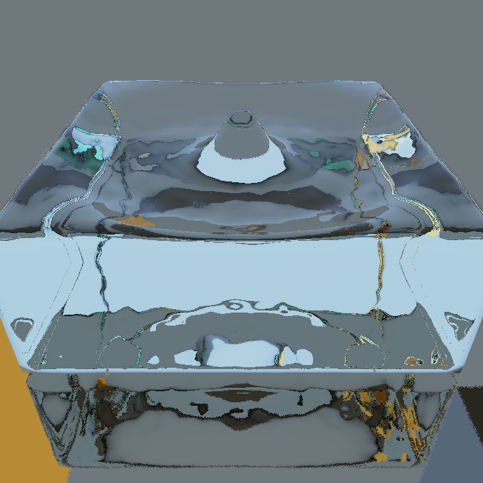

# Water in fleng: plan

Goals: as much physical correctness as possible, beautiful rendering, switchable trade-offs (live, slow, precomputed), a playground for getting a feel for Navier–Stokes, and room for more solvers and non-liquid materials later.

Decisions so far:

- **First solver:** APIC.
- **Compute:** CPU first, CUDA later.
- **Language:** the simulation core is written in Zig ([sim/](../sim/)); fleng itself stays C++.
- **Pace:** algorithms first, one concept per step, code after (see [lessons/](lessons/)).

## Core idea: simulation time is separate from render time

That one idea gives all three trade-offs with the same solver.

```
            ┌──────────── Scene (TOML) ────────────┐
            │ domain box, solids (reuse fleng SDF   │
            │ objects), fluid shapes (drop + pool), │
            │ material ρ μ σ g, quality preset      │
            └──────────────────┬───────────────────┘
                               ▼
   Solver interface:  step(dt) · stable_dt() · snapshot() · params
     ├─ APIC  (first)     ├─ VOF + surface tension (accuracy)
     ├─ LBM   (GPU speed) └─ MPM   (snow, sand, jelly: non-liquids)
                               │ snapshots (surface SDF + velocity + particles)
          ┌────────────────────┼─────────────────────┐
          ▼                    ▼                     ▼
   Live: step in the     Slow: sim on a         Bake: headless run → disk cache
   frame budget           background thread;     → playback at 60 fps, scrubbable
   (small water)          renderer stays 60 fps, timeline; can bake on the
                          shows latest frame     4060 Ti, watch on the Mac
```

- **Simulation core in `src/sim/`, no SFML/GL dependency:** a pure C++ library. The same code runs inside fleng, as a headless baker on Linux, and later on a cluster.
- **Rendering:** the solver exports the water surface as a signed distance field on a 3D grid, which is exactly what fleng's raymarcher draws. It gets uploaded as a 3D float texture and becomes a new object type in `fleng.frag`, reusing the existing refraction code, plus Fresnel reflection and depth-based absorption (Beer–Lambert). SFML has no 3D textures, so that part needs a few raw OpenGL calls. It works on the Mac's OpenGL 2.1.

## First solver: APIC

- **What it is:** a fixed grid for pressure plus particles that carry the water, with a pressure solve preconditioned by multigrid (MGPCG) and a surface built from the particles.
- **Why first:**
  - Robust, and splashes look great.
  - The grid and pressure core get reused later by VOF, smoke, and fire.
  - The particle↔grid transfer code is the same machinery MPM uses for non-liquids.
- **Limit on correctness:** APIC is physically right when surface tension doesn't matter, like a 5 cm blob falling into a 30 cm tank. For a real 2 mm raindrop crown you need VOF with height-function surface tension: milestone 5, the "accuracy mode".

## Correctness is tested, not assumed

Each solver gets validation cases with known answers:

- **Still tank:** must stay still, with pressure = ρgh. Catches fake currents.
- **Divergence after projection:** should be ≈ 0.
- **Volume conservation** over time.
- **Dam break:** front position vs the Martin & Moyce (1952) experiment.
- **Taylor–Green vortex:** checks viscosity decay.
- **Later, for surface tension:** a static drop's pressure jump (Laplace pressure) and the oscillation frequency of a drop (Rayleigh's formula).

## Playground: getting a feel for Navier–Stokes

- Sliders for viscosity, gravity, surface tension, density, resolution.
- **Toggle each term of the equation on or off** (advection, pressure, viscosity, gravity) and watch what breaks: water compresses, turns into honey, freezes in place.
- Slice views: velocity, pressure, vorticity (local spin), divergence; tracer particles; pause and single-step.
- UI via **Dear ImGui** (the imgui-sfml bindings support SFML 3).

## Compute

**CPU first, multithreaded C++.** It runs on the M4 and on Linux, and it's easy to debug. Expected on the M4:

- 64³ grid: roughly live.
- 128³: about 1 fps.
- 256³: bake only.

Data is laid out as structure-of-arrays with kernel-shaped loops, so a CUDA port for the 4060 Ti later is mechanical.

## Milestones

1. **Core:** 3D grid, APIC, MGPCG, box domain, dam-break and drop-into-pool scenes, validation tests, a headless command-line runner. **Done:** see [sim/README.md](../sim/README.md) for results and where the code departs from the lessons.
2. **Engine integration:** simulation thread and snapshots, surface SDF → 3D texture, water material in the shader. Live and slow modes. **Done:** see "Milestone 2 notes" below.
3. **Bake and playback:** cache format, timeline.
4. **Playground UI:** ImGui, live parameters, term toggles, debug slices.
5. **Accuracy mode:** VOF with height-function surface tension.
6. **Later:** CUDA backend, scene objects as obstacles, LBM, MPM, adaptive grids.

Milestone 1 is taught first as lessons, then coded in small steps:

1. [One time step of water](lessons/01-one-time-step.md)
2. [The MAC grid: where numbers live on the grid](lessons/02-mac-grid.md)
3. [Particles ↔ grid: PIC, FLIP, APIC](lessons/03-particles-and-grid.md)
4. [Gravity, moving particles, choosing Δt (CFL)](lessons/04-forces-advection-cfl.md)
5. [Pressure projection: the heart of incompressibility](lessons/05-pressure-projection.md)
6. [Solving the pressure equation: CG, then multigrid](lessons/06-pressure-solver.md)
7. [Turning particles into a water surface](lessons/07-surface-reconstruction.md)
8. [Validation: proving it's correct](lessons/08-validation.md)

## Milestone 2 notes



How the pieces fit:

- **`sim/src/capi.zig` → `libfleng_sim.a`**, declared in `sim/include/fleng_sim.h`. The Makefile builds it with `zig build` and links it into fleng.
- **`src/water.hpp`**: a simulation thread advances 1/60 s frames and publishes the surface (φ, redistanced) under a mutex. In realtime mode it never runs ahead of the wall clock; when it can't keep up, the water plays in slow motion. R restarts, T pauses.
- **Rendering**: the surface is uploaded as a 3D half-float texture on texture unit 7 (raw OpenGL; SFML has no 3D textures). In `shaders/fleng.frag` the water is one more signed-distance object: a box distance outside the grid, the texture inside it. At the surface, the sky and floor reflect with Schlick's Fresnel; the rest refracts (n = 1.33), marches through the water with Beer–Lambert absorption (measured values for pure water), and refracts out, with total internal reflection handled.
- **Settings**: `[water]` in `fleng.toml`; the camera can be placed with `camera.position` and `camera.look_at`.

Things that came up, and their fixes:

- **Redistancing**: Zhu–Bridson's φ is only about 0.4 cells deep inside the water (lesson 7, §7.4), so refracted rays crawled. The surface is now redistanced by fast sweeping before upload. Cells next to the surface get their distance rebuilt from where φ changes sign, since Zhu–Bridson's φ changes only ~0.6 per unit of distance there. It's first-order: within 10% of the true distance, overestimating by at most ~8%, so the shader marches 0.9× the distance.
- **Hit tolerance**: GPUs interpolate textures with limited-precision weights, so the sampled field is stair-stepped below ~1/256 of a texel and rays never reached the engine's 10⁻⁵ tolerance. Water uses 2% of a cell, and the entry/exit offsets are 3× that.
- **Black patches** (found after the first version): rays ping-ponged at the surface until they ran out of bounces. Right after entering, the field underestimated how deep the ray was (the ~0.6 slope above), so the inside march stopped at once, the ray was pushed back out and hit the same surface again. Fixed twice over: the distances near the surface are now rebuilt from the sign changes, and the inside march must get clear of the surface it entered before it may exit. A debug view coloring rays that exhaust their bounces showed none left.
- **Apple's linker** rejects the archive Zig writes (members not 8-byte aligned); the Makefile repacks it with `ar` + `libtool`.
- **AddressSanitizer** aborted when simulation threads exited: Zig gives its threads an alternate signal stack, which ASan then tries to free as its own. The library disables Zig's signal stacks and segfault handler (`std_options` in `capi.zig`); signal handling belongs to the host.

Limits:

- Only the reflection of the sky and floor is shown on the surface, not of other objects; objects inside the water aren't seen through it.
- The simulation competes with rendering for the CPU: the 32-cell drop runs at about 2–6 simulated frames per second inside fleng (slow motion).
- A close-up with the water filling the screen renders at ~12 fps at 700×700 on the M4.

